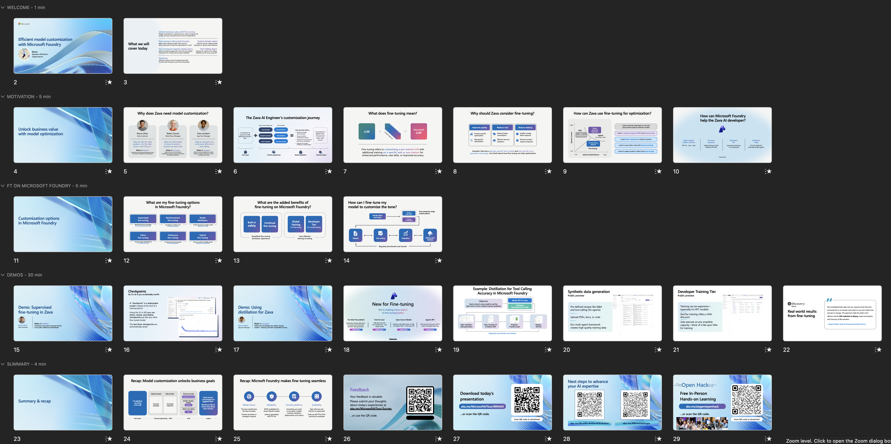

# BRK443: How To Deliver This Session

This document provides guidance for speakers delivering the session on "Efficient Model Customization with Microsoft Foundry". 

## 1. Before You Begin

This is a complex topic with multiple demos that you need to cover in 45 minutes. We recommend taking these steps to get comfortable with the resources and the narrative using Zava! 

| | |
|:---|:---|
| ✔️ | Read the document - get familiar with resources |
| ✔️ | Download the session deck - review the flow of talk|
| ✔️ | Download & watch videos - get familiar with the demos |
| ✔️ | Prepare demos 1 day before - using your own subscription|
| ✔️ | Customize your deck - to reflect your name, affiliation|
| ✔️ | Reach out to content leads - if you have any questions |
| | |

 

## 2. Review Resources 

The repository has a `src/` directory that contains all the required Python notebooks and data files used for the demos. The session slides and demo recordings have been uploaded to a cloud store and links provided below. 

_You will need to download these assets to your local device for review_.

| | ||
|:---|:---|:---|
| Presentation   |  [Deck](https://aka.ms/AAxww64) |  Powerpoint slides for the session.|
| Walkthrough | [Video](https://youtu.be/kRaMKIlV-CE) | Recorded end-to-end walkthrough for reference.  |
| Introduction | Video | Reviews the [00-introduction](./../src/00-introduction.ipynb) notebook|
| Setup | Video | Reviews the [00-setup](./../src/00-setup.md) markdown file with setup steps |
| Recorded Demo 1 | Video | Reviews the [01-custom-grader](./../src/01-custom-grader.ipynb) notebook for demo 1|
| Recorded Demo 2 | Video | Reviews the [02-basic-fine-tuning](./../src/02-basic_fine-tuning.ipynb) notebook for demo 2 |
| Recorded Demo 3 | Video | Reviews the [03-tool-calling-fine-tuning](./../src/03-tool-calling-fine-tuning.ipynb) notebook for demo 3 |
| | |

 

## 3. Prepare The Demos

This breakout session takes the audience on a journey into model customization for a "Zava Retail" use case involving DIY equipment. This is not a technique you can demo _live_ since the fine-tuning workflow can take an hour or more to complete based on GPU availability. 

_Try using this Cooking Demo approach instead_.

| | |
|:---|:---|
| **1 Day Before** | ✔️ Setup demo. Verify FT jobs completed. |
| **1 Day Before** | ✔️ Deploy to Dev Tier. Will be live for 24h. |
| **5 mins Before**| ✔️ Stage demo. Keep Browser tabs open |
| **During the Talk** | ✔️ Play pre-recorded demos to keep time|
| **After The Talk** | ✔️ Use staged demo for final step, Q&A|
| **After The Session** | ✔️ Remeber to tardown the Azure resources |
| |  |

 

## 4. Prepare The Presentation

Download the presentation and customize it with your profile picture, role and affiliation. You may want to customize speaker notes in _your copy_ to reflect your own sense of pacing and speaker style. The figure below gives high-level guidance on how to distribute session time across the sections in the outline.

||| |
|:---|:---|:---|
| 1 min | Row 1 | Introduce yourself, the topic and the talk outline |
| 5 min | Row 2 | Introduce the Zava scenario, motivation for fine-tuning |
| 5 min | Row 3 | Introduce Microsoft Foundry, support for fine-tuning|
| 30 min | Row 4 | Walk through the 3 demos, use slides if/when needed |
| 4 min | Row 5| Review what we learned, share the CTAs for next steps|
| | | |

The main takeaway messages are:

1. Model customization is key to model behavior adaptation for cost or quality
1. Microsoft Foundry offers the most choices in models, tools & features for fine-tuning
1. Our tools streamline AI ops from datagen to evaluation, fine-tuning & deployment

 

## 5. Tips & Recommendations

Here are some practical tips to help you deliver the session better:

1. **Use pre-recorded demos** during the session, to keep on time. Then use the staged demos when answering questions or to show the final outcome at the end, so audience gets a sense for the Microsoft Foundry portal and experience.
1. **Organize browser tabs into groups** if you use Microsoft Edge. This lets you use group names to show progression (1-Setup, 2-Custom-Grader) and keep Microsoft Foundry pages for each staged demo ready in separate tabs. This saves time - but also gives visual cues for developer journeys.
1. **Developer Tier lasts 24 h**. Once an FT job completes, you can deploy that to developer tier for "free" hosting for 24 hours so you can test it. The deployment is auto-deleted at that time. SO make sure you create a new deployment 12-18 hours before your session time so it is still live at that time.
1. **Delete Resource Group**. Once your session is over, don't forget to delete the resource group and make sure all resources are purged. This prevents unanticipated costs to your Azure subscriptions.

